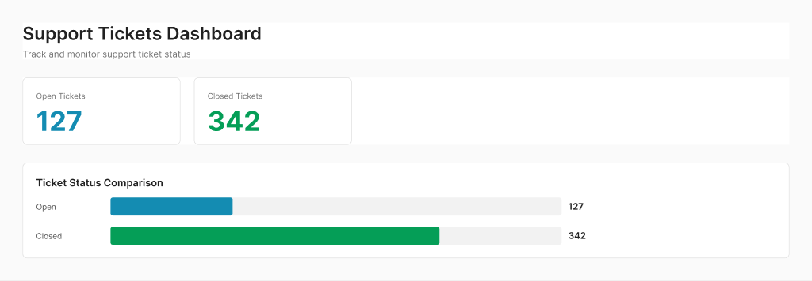

# Design Workflow with Git + Figma

## 🎯 Core Principle
**`main` branch = approved, production-ready designs**  
**Feature branches = work in progress**

---

## 📋 Standard Workflow

### 1️⃣ **Starting New Design Work**

```bash
# Make sure you're on main and up to date
git checkout main
git pull origin main

# Create a feature branch (use descriptive names)
git checkout -b feature/add-ticket-filters
# or
git checkout -b fix/metric-card-spacing
# or
git checkout -b design/mobile-responsive
```

**Branch Naming Conventions:**
- `feature/` - New design features
- `fix/` - Design fixes or tweaks
- `design/` - Major design iterations
- `experiment/` - Exploratory designs (may not merge)

---

### 2️⃣ **Making Design Changes**

```bash
# Edit in Figma, export new screenshots/assets
# (Figma auto-saves, so your design is already backed up)

# Save screenshots or assets to the repo
# Example: Update dashboard with new filter UI

# Check what changed
git status

# Stage your changes
git add dashboard-v2.png
git add assets/new-icon.svg

# Commit with clear message
git commit -m "Add ticket filter dropdown to dashboard

- Added filter UI component above metric cards
- Updated dashboard screenshot
- Exported filter icon asset

Figma: https://www.figma.com/design/tKc3BJjBRxF81a27H5Wql6"
```

---

### 3️⃣ **Committing Best Practices**

**Good commit messages:**
```bash
✅ "Add dark mode color palette to dashboard"
✅ "Fix spacing between metric cards (24px → 32px)"
✅ "Update bar chart colors to match brand guidelines"
✅ "Add mobile responsive layout screens"
```

**Bad commit messages:**
```bash
❌ "update"
❌ "changes"
❌ "fix stuff"
❌ "final version" (there's always another version 😅)
```

**Commit structure:**
```
Short summary (50 chars or less)

Longer explanation if needed:
- What changed
- Why it changed
- Link to Figma, Jira ticket, etc.
```

---

### 4️⃣ **Pushing Your Branch**

```bash
# Push your feature branch to GitHub
git push origin feature/add-ticket-filters

# First time pushing a new branch, use -u:
git push -u origin feature/add-ticket-filters
```

---

### 5️⃣ **Creating a Pull Request (PR)**

**On GitHub:**
1. Go to https://github.com/jonathon1454/option-1
2. Click "Compare & pull request" (appears after you push)
3. Write a clear PR description:

```markdown
## 🎨 Design Changes

### What's new
Added ticket filtering UI to the dashboard

### Screenshots



### Figma
https://www.figma.com/design/tKc3BJjBRxF81a27H5Wql6

### Review Checklist
- [ ] Colors match design system
- [ ] Spacing is consistent
- [ ] Accessible contrast ratios
- [ ] Mobile responsive design included

### Review needed from
@engineer-name @product-manager-name
```

4. Request reviews from team members
5. Wait for feedback

---

### 6️⃣ **Handling Feedback**

If reviewers request changes:

```bash
# Make changes in Figma
# Export updated assets

# Add and commit on the SAME branch
git add dashboard-v3.png
git commit -m "Address review feedback: increase button contrast"
git push origin feature/add-ticket-filters

# The PR automatically updates!
```

---

### 7️⃣ **Merging to Main**

Once approved:

**Option A: Merge on GitHub** (recommended)
- Click "Merge pull request" button
- Choose "Squash and merge" (cleaner history) or "Create merge commit"
- Delete the branch after merging

**Option B: Merge locally**
```bash
git checkout main
git merge feature/add-ticket-filters
git push origin main

# Delete the feature branch
git branch -d feature/add-ticket-filters
git push origin --delete feature/add-ticket-filters
```

---

### 8️⃣ **Cleaning Up**

```bash
# Switch back to main
git checkout main

# Pull the latest (includes your merged work)
git pull origin main

# Delete local feature branch
git branch -d feature/add-ticket-filters

# See what branches you have
git branch -a
```

---

## 🔄 **Quick Reference Cheat Sheet**

```bash
# Start new work
git checkout main && git pull
git checkout -b feature/my-feature

# Save work
git add .
git commit -m "Clear description of changes"
git push origin feature/my-feature

# Update from main (if main changed while you worked)
git checkout main && git pull
git checkout feature/my-feature
git merge main  # or: git rebase main

# Finish work
# 1. Create PR on GitHub
# 2. Get approval
# 3. Merge on GitHub
# 4. git checkout main && git pull
# 5. git branch -d feature/my-feature
```

---

## 💡 **Design-Specific Tips**

### What to Commit
✅ **DO commit:**
- Screenshots/exports from Figma
- Design assets (icons, illustrations)
- Documentation (specs, handoff docs)
- Figma file links (in commit messages)

❌ **DON'T commit:**
- Huge source files (PSDs, Sketch files) - use Git LFS
- Temporary files (.DS_Store, Thumbs.db)
- Personal notes or drafts

### File Organization
```
option-1/
├── designs/
│   ├── dashboard-v1.png
│   ├── dashboard-v2.png
│   └── mobile-layout.png
├── assets/
│   ├── icons/
│   └── illustrations/
├── specs/
│   └── color-palette.md
├── DESIGN_HANDOFF.md
└── README.md
```

---

## 🚨 **Common Mistakes to Avoid**

1. **Working directly on `main`**
   - Always use feature branches!

2. **Not pulling before starting**
   - You might miss teammates' updates

3. **Forgetting to push**
   - Your work isn't backed up until you push!

4. **Vague commit messages**
   - "update" tells nobody anything

5. **Giant commits**
   - Commit small, logical changes frequently

---

## 🤝 **Collaborative Workflows**

### Multiple Designers Working Together

**Scenario:** You and another designer both working on the dashboard

```bash
# You: working on filters
git checkout -b feature/ticket-filters

# Teammate: working on dark mode
git checkout -b feature/dark-mode

# Both work independently, create separate PRs
# Merge one at a time to avoid conflicts
```

### Handling Merge Conflicts (rare with design files)

If two people edited the same file:
```bash
git merge main
# CONFLICT in dashboard.png

# Option 1: Keep yours
git checkout --ours dashboard.png

# Option 2: Keep theirs  
git checkout --theirs dashboard.png

# Option 3: Use the latest design from Figma
# (re-export and overwrite)

git add dashboard.png
git commit -m "Resolve conflict: use latest Figma export"
```

---

## 🎓 **Advanced: Git Aliases for Speed**

Add to `~/.gitconfig`:
```bash
[alias]
    co = checkout
    br = branch
    ci = commit
    st = status
    unstage = reset HEAD --
    last = log -1 HEAD
    visual = log --graph --oneline --all
```

Then use:
```bash
git co main          # instead of: git checkout main
git br               # instead of: git branch
git st               # instead of: git status
```

---

## 📚 **Additional Resources**

- [GitHub Flow Guide](https://guides.github.com/introduction/flow/)
- [Conventional Commits](https://www.conventionalcommits.org/)
- [Git Best Practices](https://git-scm.com/book/en/v2)

---

**Remember:** Git is your safety net! Commit often, push regularly, and you'll never lose work. 🎉
